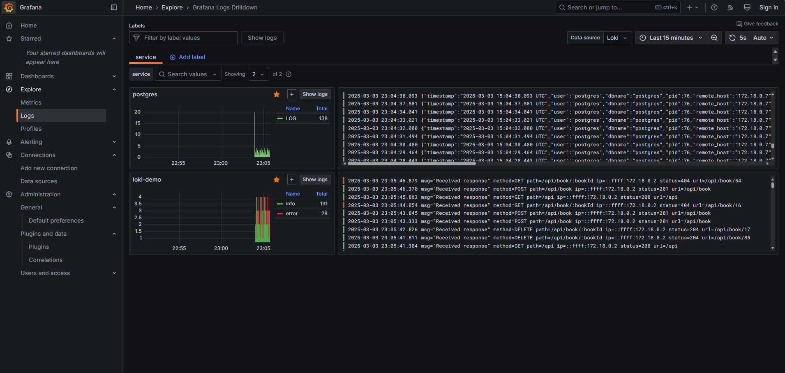

# Loki local

This repo is a demo of how to use Loki and Alloy to log and monitor a Node.js application and a PostgreSQL database locally.

Here is the tech stack:

- Node.js (Express.js) : build a simple web application server
- Alloy : collect and transform logs from the application and the database
- Loki : store logs
- Grafana : visualize logs
- PostgreSQL : store data

## How to run

```bash
docker compose up -d
```

See [localhost:3000](http:localhost:3000) for the Grafana dashboard and click `Explore > Logs` to see the logs.

## Demo


