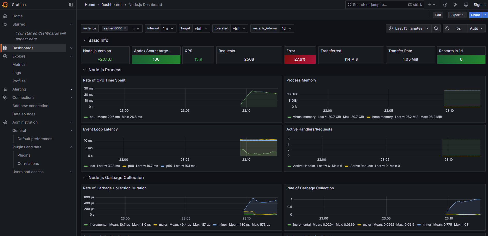
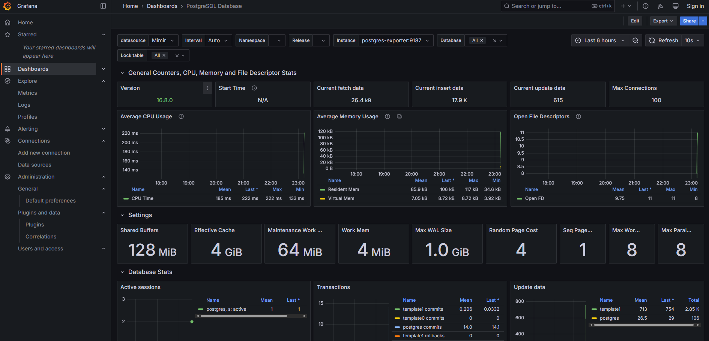

# Mimir demo

This repo is a demo of how to monitor the metrics of the application and the PostgreSQL database using Mimir.

Here is the tech stack:

- Node.js (Express.js) : build the application server
- Alloy : collect metrics from the application and postgres exporter
- Mimir : store the metrics
- Grafana : visualize the metrics
- PostgreSQL with Postgres Exporter : export the metrics of the database

## How to run

```bash
docker compose up -d
```

See `http://localhost:3000` for the Grafana dashboard. There are two dashboards, one for the application and one for the database.

## Demo




## References

- [Node.js Dashboard](https://grafana.com/grafana/dashboards/14565-node-js-dashboard/)
- [PostgreSQL Dashboard](https://grafana.com/grafana/dashboards/9628-postgresql-database/)
