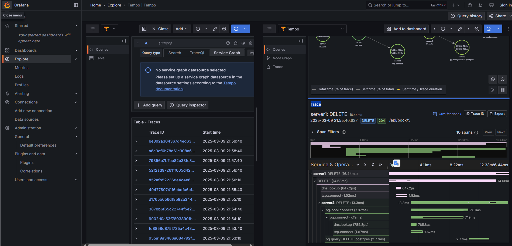

# Tempo demo

This repo is a demo of how to use Opentelemetry to trace the application using Tempo between the different services and the database.

Here is the tech stack:

- Node.js (Express.js) : build the application server with Opentelemetry standard
- Alloy : collect traces from the application
- Tempo : trace the application
- Grafana : visualize the metrics
- PostgreSQL : store the data

## How to run

```bash
docker compose up -d
```

See `http://localhost:3000` and then click Explore to see the traces. You can see the node gragh and the trace like below.

## Demo


